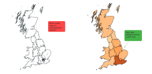
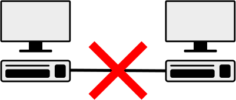
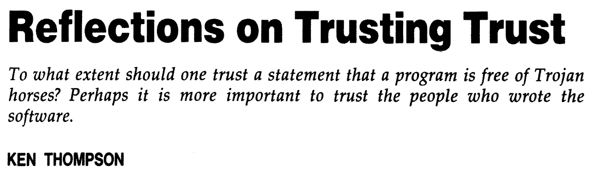

<!--
_class: title
_footer: ''
-->

# How Can a Standard Architecture for Trusted Research Environments Provide a Framework for HPC?
### Simon Li

---
# The Health Informatics Centre (HIC)

- HIC supports high impact research through the collection and management of population based data
- We have expert teams in secure data management, governance, data engineering, research infrastructure, software, and business support
- Part of the School of Medicine, University of Dundee

TODO: More HIC/UoD images

---
# Purpose of this talk
- Explain what Trusted Research Environments (TREs) are
- Why existing HPC is not generally usable for TREs
- How we can start fixing that

---
# What are TREs and why do we need them?
- Example motivating case

TODO: Image

---
## A researcher wants to do some analysis with patient data
- E.g. Electronics health records, medical images
- How can a researcher access the required data?
  - Can we give them a USB stick with all patient medical data to copy to their laptop?

TODO: Image

---
## NO! There are many reasons not to

- So what can we do instead?

---
## We could minimise the data given to the researcher...
- Data minimisation: Only provide relevant fields from relevant records
- Pseudonymisation
- Use "synthetic" data

TODO: Image

---
<!--
_footer: https://securedatagroup.org/wp-content/uploads/2019/10/sdc-handbook-v1.0.pdf
-->

## ... and limit what they can publish

<!--
For example ensure only summary statistics can be published
-->
---
## We could accredit researchers to ensure they know their responsibilities...
- training courses on how to handle sensitive data
- understand why it's important to handle sensitive data in this way
- ensure that researchers are "trusted" before they can access patient data

TODO: Image

---
## ... along with reviewing what they plan to do
- Research projects in the healthcare field already go through ethics review
- is the proposed work in the public interest?
- does it include safeguards to protect patient data?

TODO: Image

---
## We could impose virtual or physical barriers on what they can do
- provide a locked-down compute environment with access to the data but no ability to copy data out

- or only allow access to data from a physical location monitored with CCTV

---
## In the UK these are embodied in the "5 safes"
Safe
- data
- outputs
- people
- projects
- settings

and we can balance how restrictive each of these "safes" are to create a "Trusted Research Environment"

---
# Example TRE

Virtual desktop environment (Windows or Linux), accessed via a web browser

---

---

---

---

---

# Why do we need a "standard" for TREs?

In the UK 50+ TREs have organically developed over the past 15+ years.
- Duplication of effort
- Most TRE were developed independently, making them harder to maintain
- Every TRE feels different to researchers, more time is wasted understanding how each TRE works
- No single TRE has all the data you want

TODO: Image

---
## Health is devolved to the 4 nations of the UK

---
## The need for a coordinated approach has has been emphasised through several reports
In the UK
- Goldacre review
- Sudlow review

---
And across Europe
- [European Health Data Space Regulation (EHDS)](https://health.ec.europa.eu/ehealth-digital-health-and-care/european-health-data-space-regulation-ehds_en
)
  > a common framework for the use and exchange of electronic health data across the EU. It enhances individuals’ access to and control over their personal electronic health data, while also enabling certain data to be reused for public interest, policy support, and scientific research purposes.

TODO: Image

---
## Federated data analysis is unavoidable

TODO: Image

---
# SATRE: Standard Architecture for Trusted Research Environments

A guide on how to build and run a TRE
Four Architectural Principles
- Usability, Maintaining Public Trust, Observability, Standardisation
Four Pillars
- Information Governance
- Computing Technology
- Data Management
- Supporting Capabilities

29 Capabilities
- 160 statements
  - 75 mandatory

TODO: Image

---
## Built by the UK TRE community
~60 organisations engaged
- 14 Collaboration Cafés
- 25 contributors making direct changes to the content

Public Involvement
- Workshops identified transparency as a key requirement
- Reflected in three (mandatory) statements

Version 1.0 Released Oct 2023

---
## 4 pillars

<!--
It's not as easy as just securing your compute infrastructure
-->
---

<!--
1. Information governance
2. Computing technology and Information Security
3. Data management
4. Supporting Capabilities
-->
---
# SATRE examples
...

---
## Who's using SATRE?
NHS SDE
SSHN
EOSC-ENTRUST
Commercial providers

TODO: More images

---

## Not yet in SATRE: federation

SATRE is a common baseline for TRE, so now we can work on federation as part of
- DARE UK TREvolution (UK federated TREs)
- EOSC ENTRUST (European federated TREs)

---
# HPC: How is it used in TREs?
It mostly isn't

<!--
https://commons.wikimedia.org/wiki/File:Eo_circle_red_no-entry.svg
-->
---
## Typical HPC has insufficient isolation for handling sensitive data
- Outbound network access: data can be copied out
- Shared drives: people can see each other's data
- Internal network connections: data can be passed between different internal projects
- Scratch space: data could be seen by others, or left behind on a node after a job completes

TODO: Image

---
## HPC information governance
- HPC administrators may not be trained in handling sensitive data
- A typical TRE will be audited/accredited, e.g. to ISO27001. HPC facilities may not be
- Is a TRE confident HPC administrators won't make mistakes in managing access?

TODO: Image

---
# The ultimate question
"Are the public happy with their sensitive data being analysed in shared HPC facilities?"

_(replace "public" with "data owner" for other data types, e.g. commercial)_

TODO: Image

---
# What can we do?
Note: "we" includes "you"!

- Build a shared understanding of how sensitive data differs from typical HPC datasets
- Understand the drivers behind the additional restrictions that TREs impose
- Think about what technical controls are practical in current and planned HPC facilities

TODO: Image

---
## New vs existing HPC
HPC facilities are expensive:
- Can new facilities include support for TREs? (Probably)
- How much of this can be retro-fitted to existing facilities?
  - (We definitely don't know yet)
- What is the performance penalty (and does it matter?)

---
## A few starting points
This is a very active area of development, but a few areas of investigation include:
- ephemeral SLURM clusters in public cloud (SLURM nodes are ephemeral, never shared between users, storage always encrypted)

Shared HPC

Multiple isolated HPC

---
## A few starting points
- [FRIDGE (Federated Research Infrastructure by Data Governance Extension)](https://dareuk.org.uk/how-we-work/ongoing-activities/dare-uk-early-adopters/fridge/): treating a subset of HPC nodes as a TRE, and identifying what prerequisites the HPC provider must support
- Confidential computing: Zero-trust computing where even sysadmins can't access data
  - Trusted Execution Environments
  - Secure enclaves (AWS Nitro)
  - AMD SEV (Secure Encrypted Virtualization)
  - Intel Trust Domain Extensions (TDX))

TODO: Images

---
## NIST guidelines in progress

NIST have a couple of published and draft docs on securing HPC:
- [NIST SP 800-223](https://csrc.nist.gov/pubs/sp/800/223/final) High-Performance Computing Security: Architecture, Threat Analysis, and Security Posture
  - https://doi.org/10.6028/NIST.SP.800-223
- [NIST SP 800-234 Initial Public Draft](https://csrc.nist.gov/pubs/sp/800/234/ipd) High-Performance Computing (HPC) Security Overlay
  - https://doi.org/10.6028/NIST.SP.800-234.ipd

TODO: Images

---
## But don't forget, people are more important

There are limits to how "secure" your compute is

https://doi.org/10.1145/358198.358210

---
# Thanks to...

TODO: Images

---
# Links for more information
- SATRE specification https://satre-specification.readthedocs.io/
- Public evaluations https://satre.uktre.org/
- DARE UK TREvolution https://dareuk.org.uk/how-we-work/ongoing-activities/trevolution/
- EOSC ENTRUST https://eosc-entrust.eu/

TODO: Insert QRCode to online slides
